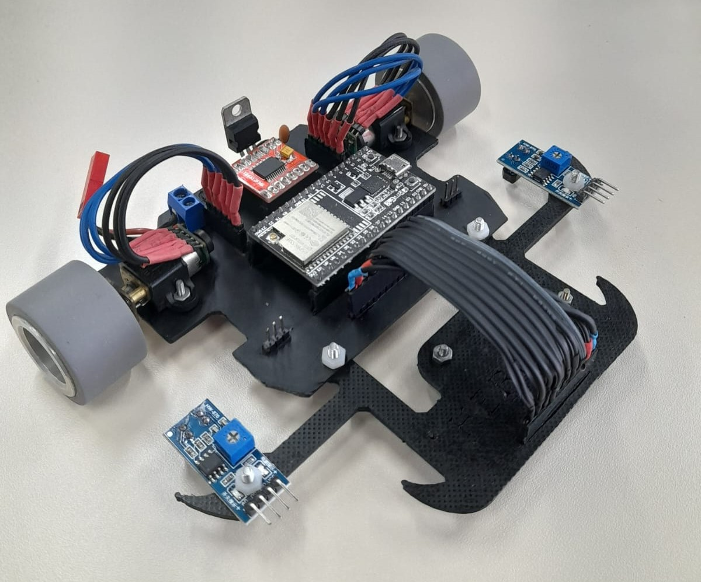
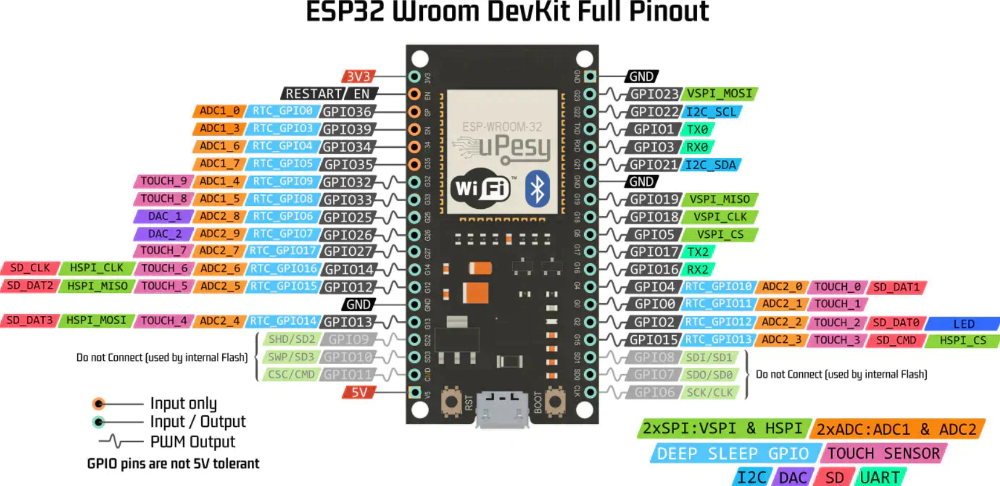

# HERMES Line Follower - RISO/GERM/UDESC

This project was developed by a group of electrical engineering and computer science students with the goal of creating a high-performance line-following robot using PID control.

## Overview

The line-following robot is designed to detect and follow tracks with high precision. It uses reflectance sensors to monitor the line and dynamically adjust its position, ensuring efficient and fast movement.

## Hardware Used

| Component          | Description                                    |
|--------------------|----------------------------------------------|
| **Microcontroller** | ESP32-WROOM                                  |
| **Line Sensors**   | Pololu QTR-8RC sensor array                  |
| **Lateral Sensors** | Two TCRT5000 sensors                        |
| **Motor Driver**   | TB6612FN                            |
| **Motors**        | Pololu N20 10,000 RPM motors with 1:10 gearbox |
| **Encoders**      | Pololu encoders                               |
| **Voltage Booster** | XL6009 Boost Step Up                        |

## Esp32 Used Pinout

## Software and Control

The robot's control is based on a PID (Proportional, Integral, and Derivative) algorithm, which adjusts the motor speed according to the data provided by the line sensors. PID ensures the robot remains stable on the track, correcting its position in real-time.

## Inputs/Outputs

Line Sensors (QTR-8RC): Return values between 0 and 4095, where 0 indicates a white surface and 4095 indicates no reflectance.

Lateral Sensors (TCRT5000): Provide four digital inputs: 0 indicates "On Line," and 1 indicates "Off Line."

Encoders: Allow speed measurement of the motors and provide feedback for dynamic PID adjustments.

PWM to Motors: Speed control is achieved through PWM signals sent to the TB6612FN H-Bridge, allowing fine adjustments of speed and direction.

## PID Tuning

Tuning the PID parameters (Kp: Proportional, Ki: Integral, Kd: Derivative) is essential for the robot's performance. Here are some guidelines:

Adjust Kp: Increase until the robot oscillates around the line.

Adjust Kd: Add a value to reduce oscillations.

Adjust Ki: Small values can help correct systematic deviations.

